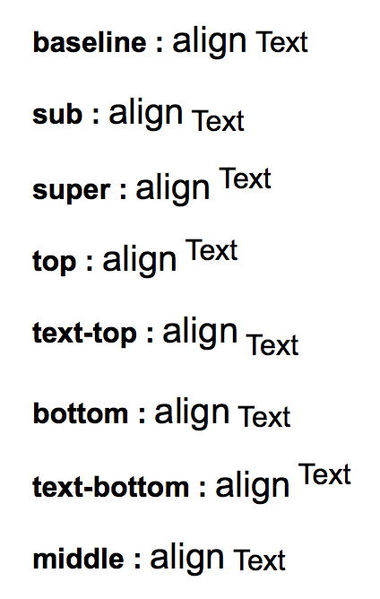

# CSS
## CSS - Cascading Style Sheet
##### 마크업 언어(HTML)가 표시되는 방법을 기술하는 언어 - 레이아웃 스타일 정의


```css
selector {
	property: value;
}
```
- `selector` 선택자 #id, .class
- `property` 속성 font-size, color...
- `value` 값

### Internal Style Sheet - html 내부에 작성
```html
<head>  
	<style type="text/css">
		#body-title {  
			font-size: 14px;
			font-weight: bold;
			color: DarkSlateGrey;  
		}
	</style>  
</head>
<body>  
	<p id="body-title">Internal Style Sheet</p>
</body>  
```

### Inline Style Sheet - 라인 안에 작성. 권장되지 않음
```html
<body>  
	<p id="body-title" style="font-size:14px; font-weight: bold; color: DarkSlateGrey">Inline Style Sheet</p>
</body>
```

### External Style Sheet - css파일을 분리하여 작성
```html
<head>  
	<link rel="stylesheet" href="style.css">
</head>  
<body>  
	<p id="body-title">External Style Sheet</p>  
</body>
```

- `link` 사용하여 외부 CSS 파일을 HTML 문서에 연결

## CSS selector
### 전체 선택자
```css
* {
	padding: 0;
}
```
- \*는 전체 선택. 내부의 개별 요소도 모두 포함

### tag selector
```css
h1 {
	color: red;
}
```
- `h1`는 html에서 사용된 태그

### class selector
```css
.section {
	color: red;
}
```

- `section`은 html 작성시 사용한 클래스명
- 쉼표로 여러개 지정 가능
- 클래스 앞에 html 태그 지정가능

### ID selector
```css
#index-title {
	color: red;
}
```
- `index-title`은 html 작성시 사용한 ID
- html 안에서 ID는 오직 하나만 존재해야 함
- class selector보다 우선순위를 가짐함

### chain selector
```css
.header-title {
	font-size: 18px;
}

.header-title.index-title {
	coclor: red;
}
```
- `<h1 class="header-title index-title">`
- 한 요소에 아이디와 클래스 또는 여러 클래스들이 적용되어 있을 경우 사용

### group selector
```css
#index-title, #index-description {
	text-align: center;
}
```
- `<h3 id="index-title">Lorem ipsum dolor sit.</h3>`
- `<p id="index-description">Lorem ipsum doloro?</p>`
- 상기 2개에 태그에 모두 적용됨

### 하위선택자
```css
section ul {
	스타일 내용;
	}
```

### 자식선택자
```css
section > ul {
	스타일 내용;
	}
```

### 인접 형제 선택자
```css
section + ul {
	스타일 내용;
	}
```

### 일반 형제 선택자
```css
section ~ ul {
	스타일 내용;
	}
```

### Attribute selector
##### 태그 내의 속성에 따름

|패턴|의미|예제|
|---|---|---|
|`E[attr]`|'attr'속성이 포함된 요소 E|`<E attr>Lorem</E>`|
|`E[attr="val"]`|'attr'속성의 값이 'val'인 요소 E|`<E attr="val">Lorem</E>`|
|`E[attr~="val"]`|'attr'속성의 값에 'val'이 포함되는 요소 E<br>(공백으로 분리된 값이 일치해야함)|`<E attr="val">Lorem</E>`<br>`<E attr="item val">Lorem</E>`<br><br>`<E attr="item-val">Lorem</E>` 공백으로 분리되지 않아 선택되지 않음|
|`E[attr\|="val"]`|'attr'속성의 값에 'val'이 공백으로 분리되어 포함되거나 'val-'이 포함된 요소 E|`<E attr="val">Lorem</E>`<br>`<E attr="val-aa">Lorem</E>`<br><br>`<E attr="Value">Lorem</E>` 알파벳으로 연결되어 있어 선택되지 않음|
|`E[attr^="val"]`|'attr'속성의 값이 'val'로 시작하는 요소 E|`<E attr="val">Lorem</E>`<br>`<E attr="value">Lorem</E>`|
|`E[attr$="val"]`|'attr'속성의 값이 'val'로 끝나는 요소 E|`<E attr="val">Lorem</E>`<br>`<E attr="item-val">Lorem</E>`|
|`E[attr*="val"]`|'attr'속성의 값에 'val'이 포함되는 요소 E<br>(공백, 대시 모두 인정)|`<E attr="val">Lorem</E>`<br>`<E attr="many value">Lorem</E>`<br>`<E attr="item-val">Lorem</E>`|


### 가상 클래스 선택자, 가상 요소 선택자
##### html 소스에 존재하지 않음
|패턴|의미|구분|
|---|---|---|
|E:link|link not visted|상태|
|E:visited|visited link|상태|
|E:active|on click|상태|
|E:hover|mouse over|상태|
|E:focus|on select|상태|
|E::first-line|첫번째 라인|위치|
|E::first-letter|첫번째 문자|위치|
|E::before|시작 지점|위치|
|E::after|끝 지점|위치|


### CSS 우선 순위
##### 특정도가 높은 순서대로 적용
|스타일|특정도|
|---|---|
|important|Absolute 어떤 선택자보다 우선|
|Inline|A|
|ID selector|B|
|Class selector|C|
|Tag selector|D|


## CSS 서체 Typography
### font color
```css
h1 {
	color: #dddddd;
}
```
h1 요소의 서체 색깔을 #dddddd로 지정 c#color number

### font family
```css
body {
	font-family: “돋움”, dotum, “굴림”, gulim, arial, helvetica, sans-serif;
}
```
body 부분의 서체를 돋움, dotum...순서로 시스템 서체를 검색하여 있는걸로 지정 ff

### font size
```css
body {
	font-size: 14px;
}
h1 {
	font-size: 28px(2em);

}
```
em은 부모 요소로 부터의 비율. rem은 디폴트 요소로 부터의 비율 fz(size)

### font style
```css
p {
	font-style: italic;
}
```
글자 스타일 fs

### font weight
```css
p {
	font-weight: bold; / 700;
}
```
lighter/normal/bold/bolder/inherit lighter, bolder는 해당 서체가 필요함
under 400/400/700/over 700
fw

### line height 줄간격
```css
p {
	line-height:1.5;
}
```
font size에 비례하여 줄간격 지정 fz(숫자)

### font decoration
```css
p {
	text-decration: none; / underline; / overline; / line-through;
}
```
밑줄, 윗줄, 취소선 a 태그에도 적용됨 td

### text align
```css
p {
	text-align: left; / center; / right; / justify;
}
```
왼쪽, 가운데, 오른쪽, 양쪽정렬(공백의 보여지는 크기가 달라질 수 있음) ta

### text indent 들여쓰기
```css
p {
	text-indent: 1em;
}
```
상속된 글자크기만큼 들여쓰기 ti

### text-transform 대소문자 변환
```css
p {
	text-transform: capitalize; / uppercase; / lowercase;
}
```
첫글자만 대문자로, 전부 대문자, 전부 소문자 tt

### letter-spacing 글자 간 간격
```css
p {
	letter-spacing: 5px;
}
```
lts

### word-spacing 단어 간 간격
```css
p {
	word-spacing: 5px;
}
```
wos

### vertical-align 요소간 수직 정렬
va


### text-align 텍스트 줄바꿈
```css
p {
	white-space: nowrap; / pre; / pre-line; / pre-wrap;
}
```
ta

* nowrap : 줄바꿈이 없음
* pre : 줄바꿈, 띄어쓰기, 공백이 모두 보임. 박스를 벗어나도 줄바꿈이 없음
* pre-line : 줄바꿈 보임, 띄어쓰기 무시. 박스 안에서 자동 줄바꿈
* pre-wrap : 줄바꿈, 띄어쓰기 모두 보임. 박스 안에서 자동 줄바꿈


# CSS Background Style 배경 스타일
### background-color
```css
div {
	background-color: #ddd; / #dddddd; / rgb(222, 222, 222); / rgba(222, 222, 222, 0.5-투명도);
}
```
bgc

### background-image 배경 이미지
```css
div {
	background-image: url('../images/icon.png');
}
```
실행되는 css 파일 위치 기준으로 상대 경로. 절대 경로도 가능 bgi

### background-repeat 배경 이미지 반복
```css
div {
	background-repeat: no-repeat; / repeat; / repeat-x; / repeat-y;
}
```
반복하지 않음, 바둑판 반복, 가로축만 반복, 세로축만 반복

### background-position 배경 이미지 위치
```css
div {
	background-position: 50% 16px; / center bottom;
}
```
x축 y축. `-`일 경우 좌, 상으로 이동. `%`는 이미지 사이즈를 기준.

### background-attachment 배경 이미지 고정
```css
div {
	background-attachment: local; / scroll; / fixed;
}
```
- `local` : 스크롤할때 이미지가 같이 움직임
- `scroll` : 스크롤과 무관하게 요소에 고정
- `fixed` : 요소와 관계없이 전체 화면 기준으로 표시. 스크롤되지 않음.

### 배경 속기법
```css
div {
	background: url('image/sample.jpg') no-repeat scroll right 50% #eee;
)
```
image, repeat, attachment, position(x,y), color를 순서대로 작성

## CSS border 테두리 스타일

### border-collapse 테두리 합치기
`table`에 적용

### border-spacing 셀 간격
`border-collapse`가 적용되었을땐 작동하지 않음

### empty-cells
- `show` : 보임
- `hode` : 안보임
- `border-collapse`가 적용되었을땐 작동하지 않음

### table-layout
- `auto` : 내용이 긴 쪽이 늘어남
- `fixed` : 셀 가로가 고정. table에서 width 값을 줘야함.

## CSS display 화면 표시 속성
### display: block
- 인라인 속성을 블럭 속성으로 바꿔줌

### display: inline
- 블럭 속성을 인라인 속성으로 바꿔줌

### display: none
- 화면에 공간을 차지하지 않고 보이지 않음. (하위요소도 안보임)

### visibility: hidden
- `hidden` : 화면에 공간은 차지하지만 안보임
- `visible` : 기본값. 보임

### overflow 화면 넘침 표시
- `hidden` : 넘친부분을 숨김
- `visible` : 넘친대로 넘친부분을 보여줌
- `auto` : 넘치면 스크롤바가 생김
- `scroll` : 넘치지 않아도 항상 스크롤바가 있음

## float 요소를 띄움
- 문서의 흐름과 별개로 취급하여 이동 가능
- 다른 요소가 블럭으로 차지하고 있는 공간으로는 이동 불가
- `float` 적용된 요소가 있던 자리에 블럭 요소가 오는 것은 가능

### clear
- `float` 요소와 겹치는 경우 `float` 속성을 해제
- 다른 `float` 요소에 방해가 되는 상황을 해제

```css
p {
	clear: both; // left, right
	clear: left;
	clear: right;
}
```

## float layout
CSS

```css
.float-frame {
    width: 300px;
    background-color: #eee;
    border: 1px solid #ddd;
    padding: 10px;
/*부모도 같이 띄음 다른 요소가 있을때 애매함*/
    /*float: left;*/

/*부모에 오버플로우를 줌 추천 안함*/
    /*overflow: auto;*/
}

/*after이라는 가상선택자로 지정*/
.float-frame::after {
    content: '';
    display: block;
    height: 0;
    clear: both;
}

.float-unit {
    width: 50px;
    background-color: #333;
    color: #fff;
    font-size: 18px;
    font-weight: bold;
    text-align: center;
    padding: 15px 0;
    margin-right: 5px;
    float: left;
}
```

HTML

```html
<!DOCTYPE html>
<html lang="ko">
<head>
    <meta charset="UTF-8">
    <meta name="viewport" content="width=device-width, initial-scale=1.0">
    <meta http-equiv="X-UA-Compatible" content="ie=edge">
    <title>Document</title>
    <link CSS>
</head>
<body>

    <div class="float-frame">
        <div class="float-unit">A</div>
        <div class="float-unit">B</div>
        <div class="float-unit">C</div>
        <div class="float-unit">D</div>

    <!-- 임의의 요소를 넣는 방법 -->
        <!-- <br style="clear:both"> -->

    </div>

</body>
</html>
```

## CSS position 요소의 위치
- `static` : 기본값
- `relative` : top, left 등으로 위치 지정 가능
- `fixed` : 브라우저 기준
- `absolute` : 가장 가까운 부모를 기준

CSS

```css
div {
    padding: 10px;
    border:1px solid black;
    color: white;
    background-color: rgba(50, 50, 50, 0.8);
}
.relative1 {
    width: 200px;
    height: 200px;
    position: relative;
}

.relative2 {
    width: 50px;
    height: 50px;
    position: relative;
    top: 30px;
    left: 20px;
}

.fixed {
    /*psf*/
    position: fixed;
    width: 100px;
    height: 50px;
    background-color: blue;
    right: 10px;
    bottom: 10px;
}

.absolute {
    position: absolute;
    width: 100px;
    height: 30px;
    background-color: red;
    color: #FFF;

/*아래 값이 적용되려면 부모인 relative1에 relative 속성을 줘야 함*/
    /*right: 0;
    bottom: 0;*/

        }
```

HTML

```html
<!DOCTYPE html>
<html lang="ko">
<head>
    <meta charset="UTF-8">
    <meta name="viewport" content="width=device-width, initial-scale=1.0">
    <meta http-equiv="X-UA-Compatible" content="ie=edge">
    <title>Document</title>
    <link CSS>
</head>
<body>
    <div class="relative1">
        relative1
        <div class="absolute">absolute1</div>
        <div class="relative2">relative2</div>
        <div class="absolute">absolute2</div>
    </div>
    <div class="fixed">fixed element</div>
</body>
</html>
```

## CSS center positioning 가운데 정렬
### 부모의 가운데로 정렬

```css
## {
	position: absolute;
	width: 200px;
	height: 100px;
	top: 50%;
	left: 50%;
	transform: translate(-50%, -50%);
}
```

## Semantic tag 시맨틱 태그
- 웹에서 자주 사용하는 구조를 태그로 만든 것
- 문서의 구조를 쉽게 알려줌

### types og semantic tag 종류
- `header` : 머릿말, 페이지의 상단 또는 왼쪽
- `nav` : 네비게이션 링크, 메뉴바
- `section` : 콘텐츠 영역
- `article` : 콘텐츠 내용
- `aside` : 본문 이외의 내용
- `footer` : 꼬릿말

# SASS Syntactically Awesome Stylesheet
- CSS 전처리기 (pre-processor)
- CSS확장언어 파일을 css 파일로 만들어줌

### SASS의 기본 구조

```sass
div.container {
	padding: 15px;
	margin: 0;  

	> p#main-title {
		font-size: 16px;
		font-weight: bold;  
	}   
	> .fixed {
		position: fixed;
		bottom: 10px;
		right: 10px;  
	}  
}
```

CSS 파일로 변환되면

```css
div.container {
	padding: 15px;
	margin: 0;  
}   
div.container > p#main-title {
	font-size: 16px;
	font-weight: bold;  
}   
div.container > .fixed {
	position: fixed;
	bottom: 10px;  
	right: 10px;  
}
```

### SASS의 출력 스타일
- expanded :위 예시와 같이 출력
- nested : 바스켓 줄바꿈이 없음
- compact : 각 설정이 1줄로 나옴
- compressed : 줄바꿈 없이 나옴. 게시할때 용량을 줄이기 위해 사용

### 주석 표시
- `//주석` 한줄 주석. css 파일에 나오지 않음
- `/* 주석 */` 여러줄 주석. css 파일에 나옴

### Nested 중첩
- 자식을 부모 안에 작성하여 자식에게 부모의 언급을 생략할 수 있음

### Referencing parent selectors 부모 참조 선택자 `&`
SASS

```sass
#page {
    width: 800px;
    border: 1px solid #eee;
    padding: 10px;

    a {
        text-decoration: none;

        &:hover {				// &는 부모 선택자를 참조
            color: red;
        }

        .link-container & { 	// &가 뒤에 있으면 뒤에 붙는데 알아보기 어려움
            font-size: 30px;
        }
    }
}
```

CSS

```css
#page {
  width: 800px;
  border: 1px solid #eee;
  padding: 10px;
}

#page a {
  text-decoration: none;
}

#page a:hover {
  color: red;
}

.link-container #page a { 	// &가 뒤에 있으면 뒤에 붙는데 알아보기 어려움
  font-size: 30px;
}
```


### Nested properties 중첩 속성
SASS

```sass
.container {
	margin: {
		left: auto;
		right: auto;
	}
}
```

CSS

```css
.container {
	margin-left: auto;
	margin-right: auto;
}
```

### Selector inheritance 선택자 상속
SASS

```sass
.btn {
    background-color: #cdcdcd;
    font-weight: bold;
    color: #white;
    padding: 5px 20px;
}
.btn-ok {
    @extend .btn;					//.btn의 속성을 상속받음
    background-color: #d9edf7;	//bgc만 변경
}
.btn-cancel {
    @extend .btn;					//.btn의 속성을 상속받음
    background-color: #bbb;		//bgc만 변경
}
```

CSS

```css
.btn, .btn-ok, .btn-cancel {
  background-color: #cdcdcd;
  font-weight: bold;
  color: #white;
  padding: 5px 20px;
}

.btn-ok {
  background-color: #d9edf7;
}

.btn-cancel {
  background-color: #bbb;
}
```

### placeholder selector 대체 선택자
SASS

```sass
%btn {
    background-color: #cdcdcd;
    font-weight: bold;
    color: white;
    padding: 5px 20px;
}
.btn-ok {
    @extend %btn;
    background-color: #d9edf7;
}
.btn-cancel {
    @extend %btn;
    background-color: #ddd;
}
```

CSS

```css
.btn-ok, .btn-cancel {			//%btn 선택자는 css에 나타나지 않음.
  background-color: #cdcdcd;
  font-weight: bold;
  color: white;
  padding: 5px 20px;
}

.btn-ok {
  background-color: #d9edf7;
}

.btn-cancel {
  background-color: #ddd;
}
```

### variable 변수
SASS

```sass
$padding: 10px;						//자주 쓰는 값을 변수에 저장
$bg-color: #fff;
$margin: 10px !global;				//전역 변수

div.container {
    background-color: $bg-color;
    padding: $padding;
}
```

CSS

```css
div.container {
  background-color: #fff;
  padding: 10px;
}
```

### variable data type 변수의 데이터 유형
|유형|Type|설명|예시|
|---|---|---|---|
|숫자|Number|정수, 소수, 단위숫자|0, 1.0, 2rem, 10px|
|문자|String|문자. 따옴표로 감싸야함|'image/sample.png', "SASS"|
|색상|Colors|색상정보|#fff, rgb(255, 255, 255)|
|참/거짓|Boolean|참 또는 거짓|True, False|
|리스트|List|공백이나 콤마로 구분된 데이터 집합|
|맵|Map||
|비어있음|Null||
