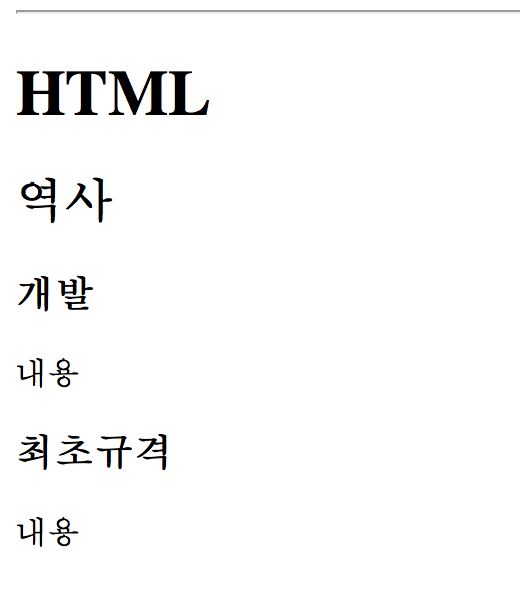

# HTML
## Hyper Text Markup Language
### 마크업 언어
태그 등을 이용하여 문서나 데이터의 구조를 명기하는 언어


### "하이퍼 텍스트"
링크를 이용해 웹 페이지를 서로 연결하는 것을 의미


`마크업을 이용해 www의 페이지를 서로 오갈 수 있는 웹 문서를 만드는 언어`


## 웹 표준
### W3C
World Wide Web Consortium.

### 웹 표준
WWW을 서술하고 정의하는 공식 표준 및 규격

### 웹 표준 지원 확인
http://html5test.com


## HTML의 기본 구조

```html
<!DOCTYPE html>
<html>
    <head>
    	<title>Document</titile>
    </head>
    <body>

    **본문이 들어갈 자리**
    <!-- 주석 표시 -->

    </body>
</html>
```

- `<!DOCTYPE html>`은 html5 문서 형식임을 의미
- `<html>`은 html 문서의 시작과 끝을 의미
- `<head>`는 html 문서의 기본 정보를 포함
- `<body>`는 본문


## 태그의 요소와 속성
(Element & Attribute)

`<요소 속성="값">`<br />
`<요소 속성="값>내용</요소>`

#### Example

```html
<a href="http://naver.com">네이버</a>

```

- `href`는 Hyper Reference(참조), `src`는 Source
- 태그는 소문자를 사용하도록 권장


## 절대경로와 상대경로
(Absolute path & Relative path)

#### 절대경로

```html

```


#### 상대경로

```html

```


- 상대경로에서 `폴더명/파일명`으로 하위 폴더 내 파일을 지정
- 상위폴더로 올라갈 경우 `../`으로 시작
- 최상위 폴더에서 사직할 경우 경로명은 `/`로 시작


## head 태그
##### 문서의 메타데이터의 집합. 사용자에게 보이지 않음.

```html
<head>
	<meta charset="UTF-8">
	<meta http-equiv="X-UA-Compatible" content="ie=edge">
	<link rel="stylesheet" href="style.css">
	<script src="script.js" charset="utf-8"></script>
	<title>Document</titile>
</head>
```

- `<meta charset="UTF-8">` 웹페이지의 인코딩 방식을 정의
- `<meta http-equiv="X-UA-Compatible" content="ie=edge">` MS IE 렌더링 방식을 최신으로 설정
- `<link rel="stylesheet" href="style.css">` CSS 파일을 연결 (상대경로)
- `<script src="script.js" charset="utf-8"></script>` JavaScript 파일을 연결 (상대경로)
- `<title>Document</titile>` 문서의 제목

###### 다양한 `meta` 태그가 존재함.

```html
<meta name="generator" content="사이트 제작 툴 혹은 에디터">
<meta name="author" content="저자 제작자">
<meta name="keywords" content="검색을 위한 키워드">
<meta name="description" content="페이지의 요약설명">
<meta name="copyright" content="저작권 정보">
<meta name="subject" content="사이트의 주제 입력">
<meta name="title" content="사이트의 타이틀">
<meta name="publisher" content="발행인 조직 혹은 기업">
<meta name="other agent" content="사이트 책임자">
<meta name="classification" content="카테고리 분류">
<meta name="reply-to(email)" content="메일주소">
<meta name="filename" content="파일명">
<meta name="author-date(date)" content="제작일">
<meta name="location" content="위치/국가">
<meta name="distribution" content="배포자">
```

## body 태그
##### 브라우저에 표시되는 내용으로 사용자에게 보일 내용

```html
<body>
    <h1>패스트캠퍼스 웹 프로그래밍 스쿨</h1>  
	<p>HTML을 배웁니다</p>  
	<blockquote>처음으로 작성한 HTML문서입니다</blockquote>
</body>
```


# Atom Editor
#### https://atom.io
- **Emmet**, **less-than-slash** 패키지 설치


# 블록과 인라인
##### 요소의 두가지 형태

## Block Elements

```html
<h1>블록 요소</h1>  
<p>p요소는 블록 형태입니다</p>
<div>div요소도 블록 형태입니다</div>
```

<h1>블록 요소</h1>  
<p>p요소는 블록 형태입니다</p>
<div>div요소도 블록 형태입니다</div><br />

- 줄바꿈이 일어나는 형태. 줄 전체의 너비값을 가짐
- 배경색 지정 시, 텍스트가 포함된 줄 전체에 적용됨


## Inline Elements

```html
<strong>strong 요소</strong>
<a href=“”>a요소</a>
<span>span요소</span>
```

<strong>strong 요소</strong>
<a href=“”>a요소</a>
<span>span요소</span>

- 줄바꿈이 없음. 텍스트 길이만큼의 너비를 가짐
- 배경색 지정 시, 텍스트 부분에만 적용


## 레이아웃 요소 div, span

```html
<div>
	<p>블럭요소 내부에 <span>인라인 요소를 사용합니다.</span></p>
</div>
```

<div>
	<p>블럭요소 내부에 <span>인라인 요소를 사용합니다.</span></p>
</div>

- `div`와 `span`은 오직 블록 방식과 인라인 방식의 레이아웃을 구현하는데에 사용합니다.


# HTML 태그
## Text Tags
##### 텍스트와 관련된 태그

### Headline

```html
<h1>HTML</h1>
<h2>역사</h2>
<h3>개발</h3>
	<p>내용</p>
<h3>최초규격</h3>
	<p>내용</p>
```

<!---->


### 줄바꾸기 p, br, etc.
#### p tag 줄 사이에 간격이 있음

```html
<p>Lorem ipsum dolor sit amet, consectetur adipisicing elit. Repudiandae sequi ratione tenetur reiciendis cum in totam atque ipsum similique quae.</p>
<p>Lorem ipsum dolor sit amet.</p>
```

<p>Lorem ipsum dolor sit amet, consectetur adipisicing elit. Repudiandae sequi ratione tenetur reiciendis cum in totam atque ipsum similique quae.</p>
<p>Lorem ipsum dolor sit amet.</p>


#### br tag 줄 사이에 간격이 없음

```html
Lorem ipsum dolor sit amet.<br>  
Lorem ipsum dolor sit amet, consectetur adipisicing elit. Tenetur, ab.<br>
```

Lorem ipsum dolor sit amet.<br>
Lorem ipsum dolor sit amet, consectetur adipisicing elit. Tenetur, ab.<br>


#### hr 수평선

```html
<hr>
```

<hr>

#### blockquote 인용문

```html
<blockquote>인용문 내용</blockquote>
```

<blockquote>인용문 내용</blockquote>

#### pre Preformatted text

```html
<pre>
def pretag_test():
     val = ‘pretag’
</pre>
```

<pre>
def pretag_test():
     val = ‘pretag’
</pre>

### 줄바꿈이 없는 텍스트 태그
#### strong, b (강조, 굵게)

```html
<strong>강조할 텍스트</strong>
<b>굵게</b>
```

<strong>강조할 텍스트</strong><br />
<b>굵게</b>

#### em, i 문맥상 특정 부분 강조, 이탤릭 표시

```html
<em>강조할 텍스트</em>
<i>기울기</i>
```

<em>강조할 텍스트</em><br />
<i>기울기</i>


#### mark 형광펜 효과

```html
<mark>형광펜 효과</mark>
```

<mark>형광펜 효과</mark>


## Image, Hyperlink tag
##### 이미지와 링크에 관련된 태그

### Anchor 링크 a

```html
<a href="http://www.daum.net" target="_blank" title="다음 열기">Click!</a>
```

<a href="http://www.daum.net" target="_blank" title="다음 열기">Click!</a>

- `href` 이동할 웹페이지 주소
- `target` 웹페이지를 여는 방법
	- `_self` 현재 창에서 열기
	- `_blank` 새 창에서 열기
- `title` 마우스오버시 보일 텍스트

### Image 이미지 img

```html

```


- src 이미지의 경로
- width 이미지의 가로 (px 단위)
- height 이미지의 세로 (px 단위)
- alt 대체 텍스트 (alternative text)

## Data tag
##### 데이터를 나타내는 태그

### 목록
#### Ordered List

```html
<ol>
	<li>항목</li>
	<li>항목</li>
	<li>항목</li>
	<li>항목</li>
	<li>항목</li>
</ol>
```

<ol>
	<li>항목</li>
	<li>항목</li>
	<li>항목</li>
	<li>항목</li>
	<li>항목</li>
</ol>

#### Unordered List

```html
<ul>
	<li>항목</li>
	<li>항목</li>
	<li>항목</li>
	<li>항목</li>
	<li>항목</li>
</ul>
```

<ul>
	<li>항목</li>
	<li>항목</li>
	<li>항목</li>
	<li>항목</li>
	<li>항목</li>
</ul>

- 리스트 구성은 html의 ol, ul 태그로 구현 후 CSS로 디자인

### 목록 속성 type, start, reversed

```html
<ol type="A" start="3" reversed>
	<li>First</li>  
	<li>Second</li>  
	<li>Third</li>  
</ol>
```

<ol type="A" start="3" reversed>
	<li>First</li>  
	<li>Second</li>  
	<li>Third</li>  
</ol>

#### type
값 | 설명
---|---
1|숫자(기본값)
a|영문 소문자
A|영문 대문자
i|로마숫자 소문자
I|로마숫자 대문자

#### start
시작할 숫자 지정

#### reversed
역순으로 표시

### 정의 목록 Description List

```html
<dl>  
	<dt>HTML</dt>  
	<dd>Hyper Text Markup Language</dd>
	<dd>웹 페이지를 구현하는 마크업 언어이다</dd>  
 	<dt>CSS</dt>  
	<dd>Cascading Style Sheet</dd>
	<dd>HTML의 형태를 지정하는 언어이다</dd>
</dl>
```

<dl>  
	<dt>HTML</dt>  
	<dd>Hyper Text Markup Language</dd>
	<dd>웹 페이지를 구현하는 마크업 언어이다</dd>  
 	<dt>CSS</dt>  
	<dd>Cascading Style Sheet</dd>
	<dd>HTML의 형태를 지정하는 언어이다</dd>
</dl>

- 중첩 사용 가능

## 테이블 요소 table
##### 표

### table의 기본 구조

```html
<table>
	<tr>  
		<th>이름</th>
		<th>나이</th>
		<th>점수</th>
	</tr>
	<tr>  
		<td>철수</td>
		<td>23세</td>
		<td>70점</td>  
	</tr>
	<tr>  
		<td>영희</td>
		<td>21세</td>
		<td>89점</td>  
	</tr>
</table>
```

<table>
	<tr>  
		<th>이름</th>
		<th>나이</th>
		<th>점수</th>
	</tr>
	<tr>  
		<td>철수</td>
		<td>23세</td>
		<td>70점</td>  
	</tr>
	<tr>  
		<td>영희</td>
		<td>21세</td>
		<td>89점</td>  
	</tr>
</table>

- `tr` table row
- `th` table header
- `td` table data

### 셀 병합 colspan

```html
<table>
	<tr>  
		<td>a</td>  
		<td>b</td>
	</tr>  
	<tr>  
		<td colspan="2">c</td>  
	</tr>
</table>
```

<table>
	<tr>  
		<td>a</td>  
		<td>b</td>
	</tr>  
	<tr>  
		<td colspan="2">c</td>  
	</tr>
</table>

- `colspan` 가로로 병합할 셀의 수만큼 값을 줌
- `th` `td`에 사용 가능

### 셀 병합 rawspan

```html
<table>
	<tr>  
		<td rowspan="3">a</td>  
		<td>b</td>
	</tr>  
	<tr>
		<td>c</td>  
	</tr>
	<tr>  
		<td>d</td>
	</tr>  
</table>
```

<table>
	<tr>  
		<td rowspan="3">a</td>  
		<td>b</td>
	</tr>  
	<tr>
		<td>c</td>  
	</tr>
	<tr>  
		<td>d</td>
	</tr>  
</table>

- `rowspan` 세로로 병합할 셀의 수만큼 값을 줌
- 다음 행의 `tr` 갯수는 병합한 만큼 줄어듦

### colgroup
##### 하나 이상의 열을 그룹핑. 특정 열, 특정 그룹에 속성을 줄 수 있음
#### HTML

```html
<table>
	<caption></caption>
	<colgroup>  
			<col />
		<col />
		<col />
	</colgroup>
</table>
```

```html
<table>
	<caption></caption>
	<colgroup span="3"></colgroup>
</table>
```

#### CSS

```css
table > colgroup {
	background: #f3f3f3;
	border-right: 3px double #333;
}
```

### 행의 구조화 thead, tbody, tfoot

```html
<table>
	<thead>  
		<tr>
			<th>이름</th>
			<th>나이</th>
			<th>성별</th>
			<th>성적</th>
			<th>메모</th>
		</tr>
	</thead>
	<tbody>
		<tr>
			<td>홍길동</td>
			<td>11</td>
			<td>22</td>
			<td>33</td>
			<td>44</td>
		</tr>
		<tr>
			<td>헛개수</td>
			<td>55</td>
			<td>66</td>
			<td>77</td>
			<td>88</td>
		</tr>
	</tbody>
	<tfoot>
		<tr>
			<td colspan="3">평균</td>
			<td>87</td>
			<td></td>
		</tr>
	</tfoot>
</table>
```

<table>
	<thead>  
		<tr>
			<th>이름</th>
			<th>나이</th>
			<th>성별</th>
			<th>성적</th>
			<th>메모</th>
		</tr>
	</thead>
	<tbody>
		<tr>
			<td>홍길동</td>
			<td>11</td>
			<td>22</td>
			<td>33</td>
			<td>44</td>
		</tr>
		<tr>
			<td>헛개수</td>
			<td>55</td>
			<td>66</td>
			<td>77</td>
			<td>88</td>
		</tr>
	</tbody>
	<tfoot>
		<tr>
			<td colspan="3">평균</td>
			<td>87</td>
			<td></td>
		</tr>
	</tfoot>
</table>

- `thead` 열의 제목
- `tbody` 표의 내용
- `tfoot` 표의 하단. 합계나 결과

## form 요소
form tag
##### 브라우저에서 서버로 데이터를 전송하기 위해 사용하는 태그

```html
<form action="" method="get">  
	<label for="username">ID</label>
	<input type="text" name="username">  
</form>
```

<form action="" method="get">  
	<label for="username">ID</label>
	<input type="text" name="username">  
</form>

### form method
##### `form`에서 서버로 데이터를 전송하는 방식을 결정
- **GET** URL에 데이터를 담아서 전달
- **POST** URL과는 별도로 데이터를 전달

### form action
##### `form`에서 데이터를 전송할 URL

### input tag 종류

```html
<input type="text" id="username">  
<input type="password" id="password">  
<input type="radio" id="radio">  
<input type="checkbox" id="checkbox">  
<input type="button">  
<input type="file" id="file">  
<input type="submit">  
<input type="reset">  
<input type="hidden" id="hidden" value="hiddenValue">
```

<input type="text" id="username">  
<input type="password" id="password">  
<input type="radio" id="radio">  
<input type="checkbox" id="checkbox">  
<input type="button">  
<input type="file" id="file">  
<input type="submit">  
<input type="reset">  
<input type="hidden" id="hidden" value="hiddenValue">

### input tag 속성들

```html
<input type="text" value="disabled" disabled>
<input type="text" value="readonly" readonly>
<input type="text" required>
<input type=“text" placeholder=“공백은 안됩니다">
<input type="text" size="3">  
<input type="text" maxlength="10">  
<input type="checkbox" checked="checked">  
<input id="radio1" type="radio" name="agree" checked="checked">
<input id="radio2" type="radio" name="agree">
```

<input type="text" value="disabled" disabled>
<input type="text" value="readonly" readonly>
<input type="text" required>
<input type=“text" placeholder=“공백은 안됩니다">
<input type="text" size="3">  
<input type="text" maxlength="10">  
<input type="checkbox" checked="checked">  
<input id="radio1" type="radio" name="agree" checked="checked">
<input id="radio2" type="radio" name="agree">

### label tag
`form` 요소에 레이블을 붙임
#### `label` 내부에 표현

```html
<label>ID <input type="text"></label>
```

<label>ID <input type="text"></label>
#### `label`과 별도로 표현

```html
<label for="username">Username</label>
<input type="text" id="username">
```

<label for="username">Username</label>
<input type="text" id="username">

- 보이는 결과는 같지만 별도로 표현하는 것이 좋다.

### select tag
#### select

```html
<select name="number" id="select-id">
	<option value="1">First</option>
	<option value="2">Second</option>
	<option value="3">Third</option>
	<option value="4">Fourth</option>  
</select>
```

<select name="number" id="select-id">
	<option value="1">First</option>
	<option value="2">Second</option>
	<option value="3">Third</option>
	<option value="4">Fourth</option>  
</select>

#### optgroup tag

```html
<select>  
	<optgroup label="Fruits">  
		<option value="apple">Apple</option>
		<option value="banana">Banana</option>
		<option value="orange">Orange</option>  
	</optgroup>  
	<optgroup label="Colors">  
		<option value="red">Red</option>
		<option value="blue">Blue</option>
		<option value="green">Green</option>
	</optgroup>
</select>
```

<select>  
	<optgroup label="Fruits">  
		<option value="apple">Apple</option>
		<option value="banana">Banana</option>
		<option value="orange">Orange</option>  
	</optgroup>  
	<optgroup label="Colors">  
		<option value="red">Red</option>
		<option value="blue">Blue</option>
		<option value="green">Green</option>
	</optgroup>
</select>

### button tag

```html
<button type="submit">submit type button</button>
<button type="reset">reset type button</button>
<button type="button">button type button</button>
```

<button type="submit">submit type button</button>
<button type="reset">reset type button</button>
<button type="button">button type button</button>

### fieldset, legend tag

```html
<body>
    <form>
        <h3>회원가입</h3>
        <fieldset>
            <legend>기본정보</legend>
            <div>
                <label for="username"><b>ID </b></label>
                <input type="text" name="username" placeholder="ID를 입력하세요" id="username">
            </div>
            <div>
                <label for="password"><b>비밀번호 </b></label>
                <input type="password" name="password" placeholder="비밀번호 입력" id="password">
            </div>
            <div>
                <label for="email">이메일 </label>
                <input type="email" name="email" id="email">
            </div>
            <div>
                <label for="gender">성별</label>
                <select class="" name="genger" id="gender">
                    <option value="woman">여성</option>
                    <option value="man">남성</option>
                </select>
            </div>
        </fieldset>
        <fieldset>
            <legend>선택입력</legend>
            <div>
                <label for="age">나이</label>
                <input type="number" name="age" id="age" min="1" max="150">
            </div>
            <div>
                <label for="address">주소</label>
                <input type="text" name="address" id="address">
            </div>
            <div>
                <label for="textbox">자기소개</label>
                <textarea name="textbox" placeholder="자기소개" id="textbox" rows="8" cols="40"></textarea>
            </div>
        </fieldset>
        <button type="submit">회원가입</button>
    </form>
</body>
```


### class, id 속성
- 첫글자는 알파벳으로 시작, 두번째 글자부터 `숫자`, `-`, `_` 사용 가능

### color
- Hex Code #000000 ~ #FFFFFF
- Color Name
- rgb, rgba

# 개발자도구
#### F12 or alt+comd+i
#### 에러는 console에서 확인
